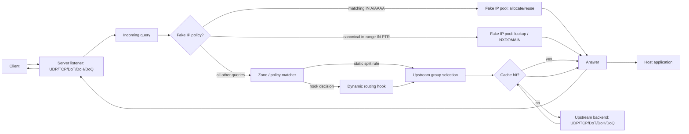
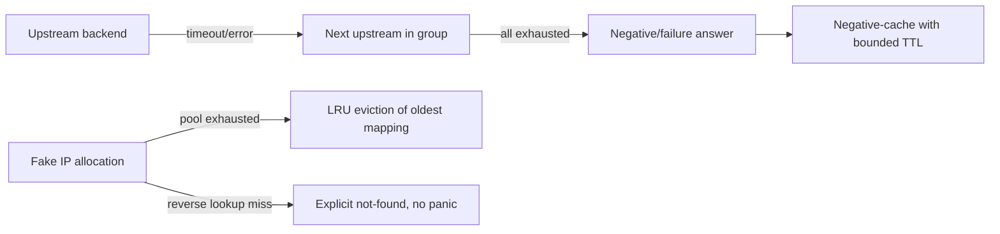

# DNS Lattice architecture

Status: draft. Stages 0.1-0.3 have landed the `dns-lattice-core` and
`dns-lattice-model` crates, resolver/cache, upstream transports, and inbound
server listeners. Stage 0.4 is active with opt-in resolver Fake IP synthesis;
later stages implement the remaining target shape incrementally. Update this
document whenever an implementation slice changes a public contract.

## Scope and role in the Lattice ecosystem

DNS Lattice is an **embeddable DNS server engine** — the DNS equivalent of
what Kestrel is for HTTP in ASP.NET Core: a full, modern, hostable server
core that any application embeds to gain a complete DNS server (inbound
listening, split DNS, Fake IP, caching, DoT/DoH/DoQ, dynamic routing) without
building one from scratch. It is the protocol/server plane for DNS, not an
OS integration layer and not a policy compiler:

```text
net-lattice      OS networking inspection/configuration (routes, DNS, interfaces)
tunnel-lattice   TUN/TAP tunnel interfaces
dns-lattice      Programmable DNS control plane            <- this crate
flow-lattice     Policy compiler: rules -> platform-neutral network plans
sdk-lattice      Application-facing SDK composing the crates above
```

- `net-lattice` reads and writes OS-level DNS configuration (e.g. system
  resolver settings, `/etc/resolv.conf`-equivalents). It does not resolve
  queries or hold routing policy.
- `flow-lattice` compiles user/operator rules into platform-neutral plans. It
  may produce the routing policy that `dns-lattice` executes, but it does not
  execute DNS lookups itself.
- `tunnel-lattice` is the ecosystem's TUN/TAP interface crate. It has its
  own data-plane scope and is not part of DNS Lattice's API or dependency
  graph.
- `sdk-lattice` wires the crates above together for an application. It is the
  only crate expected to depend on all of them simultaneously.

`dns-lattice` therefore exposes a library API consumed directly by
applications today, and by `flow-lattice` and `sdk-lattice` once those
crates are ready to build on it: `sdk-lattice` composes it with the other
Lattice crates into a full application, and `flow-lattice` is expected to
drive it through the dynamic routing hooks below once policy compilation
exists. Embedding the server core does not itself require OS privilege or
an OS-specific code path: DNS message handling, inbound query serving,
routing decisions, caching, and Fake IP allocation are pure, portable logic
that binds to a UDP/TCP socket like any other network server. Only a
capability that is inherently platform-specific (e.g. a system resolver
override, binding to a privileged port on some platforms) stays out of this
crate's core and is invoked by the composing application, typically through
`net-lattice`.

## Design goals

- **Embeddable server core, not just a resolver client.** The crate serves
  inbound DNS queries (UDP/TCP/DoT/DoH/DoQ listeners) end to end, the same
  way Kestrel serves inbound HTTP: construct, bind, serve, shut down. A host
  application gets a complete, modern DNS server by embedding this crate,
  not by wrapping a separate daemon.
- **Full modern feature parity.** Split DNS, Fake IP, caching, encrypted
  upstream transport, and programmable routing are first-class, built-in
  capabilities of the engine, not optional add-ons bolted on by a consumer
  crate.
- **Programmable, not configuration-only.** Routing and resolution decisions
  are expressed as Rust types and traits (policies, matchers, hooks), so a
  host application can implement custom logic without forking the crate.
- **Split DNS.** Queries route to different upstream groups based on
  domain/zone matchers, source context, or a caller-supplied hook, rather
  than a single fixed upstream.
- **Fake IP.** Deterministic, reversible allocation of synthetic addresses
  per domain for callers that need synthetic-address state.
- **Dynamic routing hooks.** A stable extension point so `flow-lattice`
  (or any caller) can influence per-query resolution without a compile-time
  dependency from `dns-lattice` on `flow-lattice`.
- **Backend-agnostic transport.** UDP/TCP/DoT/DoH/DoQ are interchangeable
  implementations of one upstream trait; the core never assumes a transport.
- **No hidden global state.** All engine state is owned by a value the caller
  constructs and holds; no process-wide singletons, no ambient I/O.
- **Cross-platform first.** The core crate must build and pass tests on
  Linux, Windows, and macOS with no `cfg`-gated core logic. Only backend I/O
  (sockets, TLS/QUIC stacks) may vary by platform capability, and never by
  platform *behavior*.

## Non-goals (for this crate)

- Owning or mutating OS-level DNS configuration (`net-lattice`'s job).
- Compiling user-facing rule syntax into policy (`flow-lattice`'s job); this
  crate consumes an already-structured policy/hook, not raw rule text.
- Managing TUN/TAP devices or packet forwarding.
- Shipping a standalone DNS server **product** (CLI entry point, config
  file format, process supervision, packaging as a system service). The
  crate provides the full server *engine* — listening, serving, and
  answering queries is in scope, as an embeddable library API — but turning
  that engine into an installable daemon/binary belongs to `sdk-lattice` or
  a separate application.

## Target module layout

DNS Lattice is a multi-crate workspace, mirroring `net-lattice`'s crate
topology: shared foundational types and the domain model each get their own
crate, and `dns-lattice` itself is the public-facing **facade crate** that
re-exports them and assembles the stable surface applications depend on —
it does not itself hold implementation modules beyond that re-export layer.

```text
dns-lattice-core     Error/Result shared across the workspace (implemented, stage 0.1)
dns-lattice-model    DNS message types, zones/domain matchers, policy types (implemented, stage 0.1)
dns-lattice-platform Cross-platform provider trait(s), once a stage needs OS-facing behavior (target, not yet implemented)
dns-lattice          Facade crate: re-exports model/core/engine/server/upstream (and later fakeip/hooks) as the crate's stable public surface
```

Within `dns-lattice` itself, the target module layout for capabilities not
yet split into their own crate remains:

```text
dns-lattice (facade crate)
├── server         Inbound listener(s): bind, accept, serve UDP/TCP/DoT/DoH/DoQ (implemented, stage 0.3)
├── engine         Resolver: query pipeline, cache, split-DNS routing (implemented, stage 0.2)
├── fakeip         Fake IP pool, policy, snapshots, and mapping lifecycle
├── upstream       Upstream backend trait + UDP/TCP/DoT/DoH/DoQ implementations (implemented, stage 0.3)
└── hooks          Dynamic routing hook trait(s) consumed by callers
```

`server` and `upstream` both speak UDP/TCP/DoT/DoH/DoQ but face opposite
directions: `server` accepts queries from clients, `upstream` sends queries
to resolvers. They may share transport plumbing internally, but the public
listener and backend traits stay distinct.

Module and crate names above are a target shape, not committed public
paths; the architect role confirms or revises them per bounded slice before
implementation, and any public path is recorded before it stabilizes.
`dns-lattice-core` and `dns-lattice-model` are the only crate splits made so
far (stage 0.1); further splits (e.g. a dedicated crate per
remaining module, or `dns-lattice-platform`) happen only when a stage
actually needs them.

## Core data flow



## Failure and compensation flow



Every fallible path returns a typed error; the engine never panics on
network failure, malformed upstream responses, or pool exhaustion. Exact
error types are defined when the `model` and `engine` slices are
implemented, not in this document.

## Public API surface (facade)

The `dns-lattice` facade is the recommended external import point. Its
canonical paths are domain-scoped: `dns_lattice::model`, `engine`, `server`,
`upstream`, and `fakeip`; compatible flat aliases remain available. It
re-exports, at minimum:

- `dns-lattice-model`: query/answer types, zone matcher, policy
  configuration (`Message`, `Header`, `Question`, `ResourceRecord`,
  `RecordType`, `Class`, `RData`, `DomainPattern`, `DomainMatcher`,
  `SplitDnsPolicy`, `UpstreamGroupId`) — implemented, stage 0.1.
- `dns-lattice-core`: the shared `Error`/`Result` pair — implemented,
  stage 0.1.
- `server`: the listener entry point (construct, bind, serve, shutdown) for
  embedding a full inbound DNS server.
- `engine`: the resolver entry point (construct, resolve, shutdown), usable
  standalone (no listener) for applications that only need programmatic
  resolution.
- `fakeip`: pool configuration, `FakeIpPolicy`, lookup/reverse-lookup, TTL,
  and process-local in-memory snapshot/restore types. A caller opts into
  resolver synthesis with `ResolverBuilder::fake_ip(Arc<FakeIpPool>,
  FakeIpPolicy)`: matching IN A/AAAA are local synthetic answers, and
  canonical in-range IN PTR returns a live mapping or NXDOMAIN. The mapping's
  remaining lifetime bounds the emitted DNS TTL. The crate provides no durable
  persistence or direct dependency on any sibling Lattice crate.
- `upstream`: the backend trait, so callers can implement custom transports.
- `hooks`: the dynamic routing hook trait.

Concrete type and trait names are decided per implementation slice and
recorded as ADRs before the first 0.x release stabilizes them.

## Cross-cutting concerns

- **Observability**: the engine emits structured events (query received,
  cache hit/miss, upstream selected, Fake IP allocated, failure) through a
  caller-supplied sink trait, not a hardcoded logging framework.
- **Concurrency**: the engine is safe to call concurrently; no interior
  mutability without synchronization is exposed in the public API.
- **Privilege**: none required by this crate's core. Any privileged
  operation belongs to `net-lattice` or the host OS network stack invoked
  through `upstream`'s transport implementations.
- **Testing**: ordinary tests are deterministic and use in-process fake
  upstream backends; tests requiring real network or elevated privilege are
  `#[ignore]`d and run only in dedicated privileged CI jobs.

## Relationship to `index.md` and `AGENTS.md`

This document is the architecture reference that `AGENTS.md` and `index.md`
point to. `ROADMAP.md` sequences the stages that implement it; it does not
duplicate this design. Update both together when a stage changes scope.
