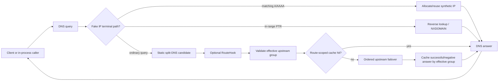

# DNS Lattice architecture

Status: implemented through stage 0.6. The code, tests, cross-platform feature
matrix, observability boundary, package validation, and release automation for
the pre-1.0 implementation roadmap are complete. The next architectural
milestone is stage 1.0: audit and freeze the public API, record the stable
SemVer contract, and publish the first stable release.

This document describes the architecture that exists at the stage-0.6 release
boundary. Update it when implementation changes a public contract or when the
stage-1.0 API audit intentionally freezes or reshapes that contract.

## Scope and role in the Lattice ecosystem

DNS Lattice is an **embeddable DNS server and resolver engine**. It is the DNS
protocol/control-plane component of the Lattice networking family: an
application embeds it to parse and serve DNS, route queries, cache answers,
use encrypted DNS transports, synthesize Fake IP addresses, and inject dynamic
route selection without running a separate DNS daemon.

```text
net-lattice      OS networking inspection/configuration (routes, DNS, interfaces)
tunnel-lattice   TUN/TAP tunnel interfaces and related data-plane primitives
dns-lattice      Programmable DNS resolver/server engine        <- this repository
flow-lattice     Policy compiler: rules -> platform-neutral network plans
sdk-lattice      Application-facing composition layer
```

Dependency and responsibility boundaries are deliberate:

- `net-lattice` owns OS-level resolver/DNS configuration. DNS Lattice does not
  modify system DNS settings.
- `tunnel-lattice` owns TUN/TAP devices and packet forwarding. DNS Lattice has
  no direct dependency on it.
- `flow-lattice` may implement DNS Lattice's route-hook contract to influence
  query routing, but DNS Lattice does not compile a user-facing rule language.
- `sdk-lattice` or another host application composes DNS Lattice with sibling
  Lattice components.

## Design goals

- **Embeddable server core.** A host can construct, bind, serve, and shut down
  inbound DNS listeners without wrapping a separate daemon.
- **Resolver and server in one engine.** The same resolver pipeline is usable
  directly in-process or behind inbound UDP/TCP/DoT/DoH/DoQ listeners.
- **Split DNS.** Static policy chooses an upstream group by deterministic
  domain matching.
- **Programmable routing.** One optional caller-owned route hook may select a
  different existing upstream group per ordinary query.
- **Fake IP.** Deterministic, reversible synthetic IPv4/IPv6 allocation with
  TTL, bounded per-family LRU eviction, reverse lookup, and caller-owned
  process-local snapshots.
- **Backend-agnostic transport.** UDP, TCP, DoT, DoH (HTTP/1.1, HTTP/2,
  HTTP/3), and DoQ implement explicit transport boundaries instead of leaking
  transport details into resolver policy.
- **Deterministic cache identity.** Ordinary cached answers are scoped by the
  effective upstream group, so equal DNS questions routed differently cannot
  share an answer accidentally.
- **Non-authoritative observability.** Structured events expose resolver
  transitions without granting a sink authority over routing, cache state,
  retries, or answers.
- **No hidden global state.** Resolver, cache, Fake IP state, hooks,
  observability, server listeners, and upstream backends are owned by values
  constructed by the caller.
- **Cross-platform first.** The supported public surface builds and is tested
  on Linux, Windows, and macOS with the same behavior contract.

## Non-goals

DNS Lattice does not:

- own or mutate OS resolver configuration;
- manage TUN/TAP devices or forward arbitrary packets;
- compile a user/operator rule language;
- provide a standalone CLI/config-file/service-supervision product;
- persist Fake IP state durably or define a snapshot serialization format;
- silently perform OS/network side effects from route hooks or observability
  callbacks.

A host application may build these capabilities around DNS Lattice, but they
remain outside this crate's authority.

## Workspace and module layout

The workspace has three published crates:

```text
dns-lattice-core     Shared Error/Result boundary
dns-lattice-model    DNS wire model, matcher, and split-DNS policy types
dns-lattice          Public facade plus resolver/server implementation
```

`dns-lattice-core` and `dns-lattice-model` deliberately contain no socket or
OS integration. The `dns-lattice` crate is both the recommended public facade
and the home of the runtime engine modules.

Canonical public modules are:

```text
dns_lattice::core           shared Error/Result
dns_lattice::model          DNS message/record/name/matcher/policy types
dns_lattice::engine         Resolver and ResolverBuilder
dns_lattice::upstream       outbound backend trait and transports
dns_lattice::server         inbound listeners and server lifecycle
dns_lattice::fakeip         synthetic address pool/policy/snapshots
dns_lattice::hooks          dynamic route-selection hook contract
dns_lattice::observability  structured resolver event sink contract
```

There are intentionally no flat root aliases for domain types. Applications
should import from the canonical domain module so the API boundary stays
explicit ahead of the 1.0 freeze.

## Resolver data flow



Resolver precedence is contractual:

1. validate/decode the DNS query and identify the first question used for
   routing;
2. execute terminal Fake IP handling when policy selects it;
3. compute the static split-DNS candidate;
4. invoke at most one optional route hook;
5. validate the effective group selected by static policy/hook;
6. check the cache scoped to that effective group;
7. try upstream backends in registration order;
8. cache a cacheable answer and return it.

A hook failure, unknown selected group, or selected group with no backends is
an error. DNS Lattice does not silently fall back to a different static group
after the hook has failed or selected an invalid route.

## DNS model and matching

`dns-lattice-model` owns the protocol/domain types used throughout the engine:

- DNS `Message`, `Header`, `Question`, and `ResourceRecord` wire model;
- record/class/RData types required by the implemented engine;
- DNS `Name` and bounded name decompression/encoding behavior;
- `DomainPattern` and `DomainMatcher<T>` with deterministic
  exact/suffix/wildcard precedence;
- `UpstreamGroupId` and `SplitDnsPolicy`.

Malformed input must return typed errors rather than panic or loop. Stage-0.6
hardening adds deterministic property-style coverage for parsing, compression
bounds, and matcher precedence.

## Cache contract

The resolver owns an in-memory answer cache that respects positive TTLs and
RFC 2308-style negative caching. Cache identity includes the effective
upstream group in addition to the DNS question identity. This is required by
dynamic routing: a response obtained from one route must never satisfy a query
that the hook routes to another group.

Fake IP terminal answers bypass the ordinary answer cache because their
lifetime is governed by the Fake IP mapping itself.

## Fake IP contract

`fakeip::FakeIpPool` is synchronous and internally synchronized so it can be
shared by concurrent resolver calls. A pool may configure IPv4, IPv6, or both.
For each family it provides:

- deterministic domain -> synthetic-address allocation/reuse;
- address -> active-domain reverse lookup;
- bounded inclusive address ranges;
- per-family LRU eviction when a configured range is full;
- required whole-second TTL and expiry;
- caller-owned in-memory snapshot/restore of live mappings and LRU state.

`FakeIpPolicy` makes resolver synthesis explicit. Matching IN A/AAAA queries
return a local synthetic answer; canonical PTR queries for configured ranges
return the active mapping or NXDOMAIN. A selected but disabled address family
returns local NODATA. Emitted DNS TTL never exceeds the mapping's remaining
lifetime.

The crate supplies no durable persistence or serialization format for
snapshots.

## Route-hook contract

`hooks::RouteHook` is an optional, one-at-a-time selection boundary. The hook
receives the first DNS question and tentative static upstream group and returns
one of two decisions:

- `Use(group)` — use a caller-selected existing upstream group;
- `Abstain` — keep the static candidate.

The hook cannot receive resolver/backend handles, rewrite DNS answers, mutate
cache policy, perform resolver re-entry, or gain OS/network side-effect
authority through DNS Lattice. Hook implementations own their own timeout,
retry, cancellation cleanup, and any external integration they choose to call.

Dropping the resolver future drops the in-flight hook future. Same-resolver
re-entry is prohibited because it can create recursion/deadlock semantics that
do not belong in the routing boundary.

## Observability contract

`observability::ObservabilitySink` is opt-in, synchronous, and
non-authoritative. The resolver emits immutable bounded events describing
query receipt, Fake IP terminal behavior, route selection/hook outcomes,
cache hit/miss, upstream attempts/outcomes, timeouts, and terminal failures.

The sink contract has strict isolation properties:

- callbacks cannot alter a resolver decision or answer;
- callbacks receive no resolver/backend handles or privileged OS authority;
- resolver locks are released before callbacks run;
- a callback panic is isolated from resolver correctness;
- DNS Lattice does not create a background logging queue or require a logging
  framework.

Applications may adapt these events to tracing, metrics, logs, or telemetry
outside the crate.

## Upstream transport contract

`upstream::UpstreamBackend` is asynchronous. A matched upstream group owns an
ordered list of backends. The resolver tries them in registration order;
timeout/transport/TLS failures may advance to the next backend. If all
backends fail, the last failure is returned and no successful answer is
inserted into the cache.

Implemented transports:

| Transport | Cargo feature | Notes |
|---|---|---|
| UDP | default | Falls back to TCP when a response is truncated (`TC=1`). |
| TCP | default | RFC 1035 length-prefixed framing. |
| DoT | `dot` | TLS via `rustls`/`tokio-rustls`. |
| DoH HTTP/1.1 + HTTP/2 | `doh` | TLS/HTTP via `hyper`/`hyper-rustls`. |
| DoH HTTP/3 | `doh` | QUIC/HTTP3, ALPN `h3`, TLS 1.3. |
| DoQ | `doq` | QUIC, ALPN `doq`, TLS 1.3. |

Encrypted features are default-off so the baseline UDP/TCP build does not
inherit TLS/HTTP/QUIC dependency weight.

## Inbound server contract

`server::ServerBuilder` embeds an `Arc<Resolver>` and may bind multiple
listener types:

- UDP and TCP in the baseline build;
- DoT with `dot`;
- DoH over HTTP/1.1/HTTP/2 and DoH3 over HTTP/3 with `doh`;
- DoQ with `doq`.

The host supplies TLS/QUIC server configuration and certificate material.
DNS Lattice does not provision certificates or request privileged ports.
Resolver errors are represented as DNS `SERVFAIL` answers where the inbound
protocol has a valid DNS request to answer; malformed requests that cannot be
reliably associated with a DNS transaction follow the listener's documented
protocol validation behavior.

## Concurrency and ownership

- Resolver operations are asynchronous and may run concurrently.
- Shared mutable state is synchronized internally and is not exposed as
  unsynchronized public interior mutability.
- Server ownership/lifecycle is explicit: configure, bind, serve, shut down.
- No process-wide resolver, cache, hook, sink, or Fake IP singleton exists.
- Cancellation is represented by dropping futures rather than hidden worker
  ownership in the core resolver path.

## Platform and validation contract

Stage 0.6 makes the cross-platform promise executable in CI. Linux, Windows,
and macOS run workspace format/lint/check/test/doc validation. The facade also
runs strict per-feature check/test/rustdoc coverage for:

- `--no-default-features`;
- `dot`;
- `doh`;
- `doq`;
- `--all-features`.

CI additionally lists package contents for the workspace and executes the
hermetic release-automation regression. These validation paths do not publish
crates or require privileged OS networking.

## Stage 1.0 stabilization boundary

The implementation roadmap through stage 0.6 is complete, but the API is not
stable until 1.0. Stage 1.0 is intentionally about commitment rather than a
new feature family. Before `1.0.0` the project must:

- audit every public module/type/trait/method and remove accidental exposure;
- decide and document the compatibility surface that will be protected by
  SemVer;
- reconcile naming and ergonomics where a pre-1.0 breaking cleanup is still
  justified;
- verify package contents and docs.rs behavior for the final public surface;
- synchronize README, architecture, roadmap, changelog, security/support, and
  crate documentation with the frozen API;
- publish the first stable crates.io release.

After `1.0.0`, ordinary SemVer compatibility requirements apply to the frozen
public contract.
