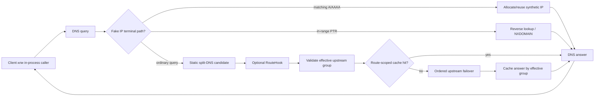

# Архитектура DNS Lattice

Статус: реализована до стадии 0.6 включительно. Код, тесты,
кроссплатформенная feature-матрица, observability boundary, package validation
и release automation для pre-1.0 роадмапа реализации завершены. Следующий
архитектурный этап — стадия 1.0: аудит и заморозка публичного API, фиксация
стабильного SemVer-контракта и публикация первого стабильного релиза.

Этот документ описывает архитектуру на границе релиза стадии 0.6. Обновляйте
его, когда реализация меняет публичный контракт или когда аудит стадии 1.0
намеренно замораживает либо перерабатывает такой контракт.

## Область ответственности и место в экосистеме Lattice

DNS Lattice — **встраиваемый DNS server/resolver engine**. Это DNS-протокольный
и control-plane компонент семейства Lattice: приложение встраивает его, чтобы
разбирать и обслуживать DNS, маршрутизировать запросы, кэшировать ответы,
использовать шифрованные DNS-транспорты, синтезировать Fake IP и подключать
динамический выбор маршрута без запуска отдельного DNS-демона.

```text
net-lattice      Инспекция/настройка сети ОС (routes, DNS, interfaces)
tunnel-lattice   TUN/TAP-интерфейсы и связанные data-plane примитивы
dns-lattice      Программируемый DNS resolver/server engine      <- этот репозиторий
flow-lattice     Компилятор политик: rules -> platform-neutral network plans
sdk-lattice      Application-facing слой композиции
```

Границы зависимостей и ответственности намеренные:

- `net-lattice` владеет DNS/resolver-настройками ОС. DNS Lattice не изменяет
  системные DNS-настройки.
- `tunnel-lattice` владеет TUN/TAP-устройствами и packet forwarding. У DNS
  Lattice нет прямой зависимости от него.
- `flow-lattice` может реализовывать route-hook контракт DNS Lattice и влиять
  на маршрутизацию запросов, но DNS Lattice не компилирует пользовательский
  язык правил.
- `sdk-lattice` или другое host-приложение компонует DNS Lattice с соседними
  компонентами семейства.

## Цели дизайна

- **Встраиваемое серверное ядро.** Host может создать, bind, запустить и
  остановить входящие DNS listeners без обёртки вокруг отдельного демона.
- **Resolver и server в одном engine.** Один и тот же resolver pipeline можно
  использовать напрямую in-process или за входящими UDP/TCP/DoT/DoH/DoQ
  listeners.
- **Split DNS.** Статическая политика выбирает upstream group через
  детерминированный domain matcher.
- **Программируемая маршрутизация.** Один необязательный caller-owned route
  hook может выбрать другую существующую upstream group для обычного запроса.
- **Fake IP.** Детерминированное обратимое выделение синтетических IPv4/IPv6 с
  TTL, ограниченным per-family LRU-вытеснением, reverse lookup и caller-owned
  process-local snapshots.
- **Транспорт-независимое ядро.** UDP, TCP, DoT, DoH (HTTP/1.1, HTTP/2,
  HTTP/3) и DoQ реализуют явные transport boundaries и не протекают в
  resolver policy.
- **Детерминированная cache identity.** Обычные кэшированные ответы включают
  effective upstream group в область идентичности, поэтому одинаковые DNS
  questions, отправленные разными маршрутами, не могут случайно разделить
  ответ.
- **Неавторитетная наблюдаемость.** Структурированные события показывают
  переходы resolver pipeline, но не дают sink права влиять на routing, cache,
  retries или ответы.
- **Нет скрытого global state.** Resolver, cache, Fake IP state, hooks,
  observability, server listeners и upstream backends принадлежат явно
  созданным вызывающим кодом объектам.
- **Cross-platform first.** Поддерживаемый public surface собирается и
  тестируется на Linux, Windows и macOS с одинаковым поведенческим контрактом.

## Не-цели

DNS Lattice не:

- владеет или изменяет resolver-конфигурацию ОС;
- управляет TUN/TAP-устройствами и не пересылает произвольные пакеты;
- компилирует пользовательский/operator rule language;
- поставляет standalone CLI/config-file/service-supervision продукт;
- выполняет долговременное хранение Fake IP state и не задаёт формат
  сериализации snapshots;
- выполняет скрытые OS/network side effects из route hooks или observability
  callbacks.

Host-приложение может построить такие возможности вокруг DNS Lattice, но они
не входят в authority этого крейта.

## Структура workspace и модулей

Workspace содержит три публикуемых крейта:

```text
dns-lattice-core     Общая граница Error/Result
dns-lattice-model    DNS wire model, matcher и split-DNS policy types
dns-lattice          Public facade + реализация resolver/server
```

`dns-lattice-core` и `dns-lattice-model` намеренно не содержат socket- или
OS-интеграции. `dns-lattice` одновременно является рекомендуемым публичным
facade crate и местом реализации runtime engine modules.

Канонические публичные модули:

```text
dns_lattice::core           общий Error/Result
dns_lattice::model          DNS message/record/name/matcher/policy types
dns_lattice::engine         Resolver и ResolverBuilder
dns_lattice::upstream       outbound backend trait и transports
dns_lattice::server         inbound listeners и server lifecycle
dns_lattice::fakeip         synthetic address pool/policy/snapshots
dns_lattice::hooks          dynamic route-selection hook contract
dns_lattice::observability  structured resolver event sink contract
```

Плоских root aliases для domain types намеренно нет. Приложения должны
импортировать типы из канонического domain module, чтобы API boundary оставался
явным перед freeze стадии 1.0.

## Поток данных resolver



Порядок resolver pipeline является частью контракта:

1. проверить/декодировать DNS query и определить первый question для routing;
2. выполнить terminal Fake IP handling, если его выбирает policy;
3. вычислить статического split-DNS кандидата;
4. вызвать не более одного optional route hook;
5. проверить effective group, выбранную static policy/hook;
6. проверить cache в области этой effective group;
7. попробовать upstream backends в порядке регистрации;
8. закэшировать cacheable answer и вернуть его.

Ошибка hook, неизвестная выбранная group или group без backends — это ошибка.
DNS Lattice не выполняет молчаливый fallback к другой static group после
ошибки hook или некорректного выбора.

## DNS-модель и matching

`dns-lattice-model` владеет protocol/domain типами, используемыми engine:

- DNS `Message`, `Header`, `Question` и `ResourceRecord` wire model;
- record/class/RData types, необходимые реализованному engine;
- DNS `Name` и bounded name decompression/encoding;
- `DomainPattern` и `DomainMatcher<T>` с детерминированным приоритетом
  exact/suffix/wildcard;
- `UpstreamGroupId` и `SplitDnsPolicy`.

Некорректный input должен возвращать typed error, а не panic или бесконечный
цикл. Hardening стадии 0.6 добавляет детерминированное property-style покрытие
parsing, compression bounds и matcher precedence.

## Контракт кэша

Resolver владеет in-memory answer cache с учётом positive TTL и RFC 2308-style
negative caching. Cache identity включает effective upstream group вместе с
идентичностью DNS question. Это необходимо для dynamic routing: ответ,
полученный через один маршрут, не должен обслужить запрос, который hook
направил в другую group.

Terminal Fake IP ответы обходят обычный answer cache, поскольку их lifetime
определяется самим Fake IP mapping.

## Контракт Fake IP

`fakeip::FakeIpPool` синхронный и внутренне синхронизированный, поэтому им
можно делиться между конкурентными resolver calls. Pool может включать IPv4,
IPv6 или оба семейства. Для каждого семейства он предоставляет:

- детерминированное domain -> synthetic-address allocation/reuse;
- address -> active-domain reverse lookup;
- bounded inclusive address ranges;
- per-family LRU eviction при заполнении диапазона;
- обязательный whole-second TTL и expiry;
- caller-owned in-memory snapshot/restore живых mappings и LRU state.

`FakeIpPolicy` явно включает resolver synthesis. Совпавшие IN A/AAAA queries
возвращают локальный synthetic answer; канонические PTR queries по
сконфигурированным диапазонам возвращают active mapping либо NXDOMAIN.
Выбранное, но отключённое address family возвращает local NODATA. DNS TTL
никогда не превышает remaining lifetime mapping.

Крейт не предоставляет durable persistence или serialization format для
snapshots.

## Контракт route hook

`hooks::RouteHook` — optional one-at-a-time selection boundary. Hook получает
первый DNS question и tentative static upstream group и возвращает одно из
двух решений:

- `Use(group)` — использовать выбранную caller существующую upstream group;
- `Abstain` — оставить static candidate.

Hook не получает resolver/backend handles, не переписывает DNS answers, не
меняет cache policy, не выполняет resolver re-entry и не получает OS/network
side-effect authority через DNS Lattice. Реализация hook сама владеет timeout,
retry, cancellation cleanup и внешними интеграциями, которые она вызывает.

Drop resolver future приводит к drop in-flight hook future. Re-entry в тот же
resolver запрещён, поскольку создаёт recursion/deadlock semantics, которым не
место в routing boundary.

## Контракт observability

`observability::ObservabilitySink` — opt-in, synchronous и
non-authoritative. Resolver отправляет immutable bounded events о query
receipt, terminal Fake IP behavior, route selection/hook outcomes, cache
hit/miss, upstream attempts/outcomes, timeouts и terminal failures.

Контракт sink имеет строгие свойства изоляции:

- callback не может изменить resolver decision или answer;
- callback не получает resolver/backend handles или privileged OS authority;
- resolver locks освобождаются до вызова callback;
- panic callback изолирован от корректности resolver;
- DNS Lattice не создаёт background logging queue и не требует конкретного
  logging framework.

Приложение может адаптировать эти events к tracing, metrics, logs или telemetry
за пределами крейта.

## Контракт upstream transports

`upstream::UpstreamBackend` асинхронный. Matched upstream group владеет
упорядоченным списком backends. Resolver пробует их в порядке регистрации;
timeout/transport/TLS failures могут переключить выполнение на следующий
backend. Если все backends завершились ошибкой, возвращается последняя ошибка,
а успешный answer в cache не вставляется.

Реализованные transports:

| Transport | Cargo feature | Примечание |
|---|---|---|
| UDP | default | Переходит на TCP при truncated response (`TC=1`). |
| TCP | default | RFC 1035 length-prefixed framing. |
| DoT | `dot` | TLS через `rustls`/`tokio-rustls`. |
| DoH HTTP/1.1 + HTTP/2 | `doh` | TLS/HTTP через `hyper`/`hyper-rustls`. |
| DoH HTTP/3 | `doh` | QUIC/HTTP3, ALPN `h3`, TLS 1.3. |
| DoQ | `doq` | QUIC, ALPN `doq`, TLS 1.3. |

Encrypted features по умолчанию выключены, поэтому baseline UDP/TCP build не
получает TLS/HTTP/QUIC dependency weight.

## Контракт inbound server

`server::ServerBuilder` встраивает `Arc<Resolver>` и может bind несколько
типов listeners:

- UDP и TCP в baseline build;
- DoT с `dot`;
- DoH поверх HTTP/1.1/HTTP/2 и DoH3 поверх HTTP/3 с `doh`;
- DoQ с `doq`.

Host передаёт TLS/QUIC server configuration и certificate material. DNS Lattice
не генерирует сертификаты и не запрашивает privileged ports. Resolver errors
представляются DNS `SERVFAIL` answers там, где inbound protocol содержит
валидный DNS request, на который можно ответить; malformed requests без
надёжной DNS transaction identity обрабатываются согласно documented protocol
validation конкретного listener.

## Конкурентность и ownership

- Resolver operations асинхронны и могут выполняться конкурентно.
- Shared mutable state синхронизирован внутри и не выставляется как
  unsynchronized public interior mutability.
- Server lifecycle явный: configure, bind, serve, shutdown.
- Нет process-wide resolver/cache/hook/sink/Fake IP singleton.
- Cancellation выражается drop futures, а не скрытым worker ownership в core
  resolver path.

## Контракт платформ и валидации

Стадия 0.6 делает cross-platform обещание исполняемым в CI. Linux, Windows и
macOS запускают workspace format/lint/check/test/doc validation. Facade также
проходит strict per-feature check/test/rustdoc для:

- `--no-default-features`;
- `dot`;
- `doh`;
- `doq`;
- `--all-features`.

CI дополнительно перечисляет package contents workspace и запускает hermetic
release-automation regression. Эти validation paths не публикуют crates и не
требуют privileged OS networking.

## Граница стабилизации стадии 1.0

Роадмап реализации до стадии 0.6 включительно завершён, но API не считается
стабильным до 1.0. Стадия 1.0 намеренно посвящена обязательству по контракту,
а не новой feature family. До `1.0.0` проект должен:

- провести аудит каждого public module/type/trait/method и убрать случайно
  выставленный surface;
- определить и задокументировать compatibility surface, защищаемый SemVer;
- согласовать naming и ergonomics там, где до 1.0 ещё оправдан breaking cleanup;
- проверить package contents и docs.rs behavior для финального public surface;
- синхронизировать README, architecture, roadmap, changelog, security/support
  и crate documentation с замороженным API;
- опубликовать первый стабильный crates.io release.

После `1.0.0` к замороженному публичному контракту применяются обычные
требования SemVer compatibility.
