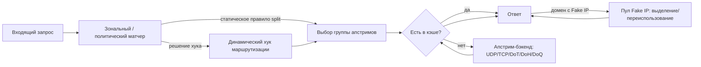
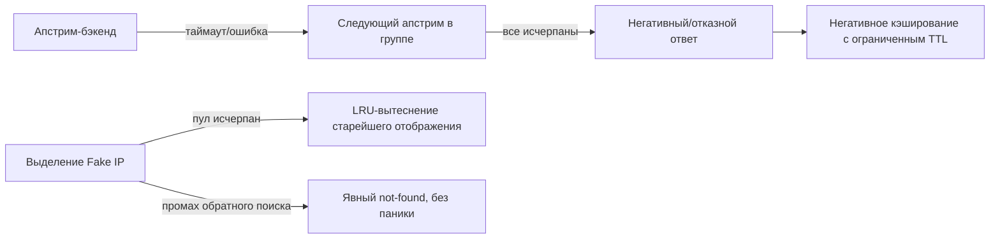

# Архитектура DNS Lattice

Статус: черновик, стадия 0.0 (аудит и базовый дизайн). Кода реализации пока
нет; документ описывает целевую форму, которую последующие стадии
реализуют постепенно. Обновляйте его при каждом изменении публичного
контракта и фиксируйте решение в виде ADR в актуальном рабочем каталоге
`.ai/<task-name>/adr/`.

## Место в экосистеме Lattice

DNS Lattice — это **плоскость протокола и политики DNS**, а не слой
интеграции с ОС и не компилятор политик:

```text
net-lattice      Инспекция и настройка сетевого стека ОС (маршруты, DNS, интерфейсы)
tunnel-lattice   TUN/TAP туннельные интерфейсы
dns-lattice      Программируемый DNS control plane                 <- этот крейт
flow-lattice     Компилятор политик: правила -> платформенно-нейтральные планы
sdk-lattice      Прикладной SDK, объединяющий крейты выше
```

- `net-lattice` читает и изменяет DNS-настройки уровня ОС (системный
  резолвер, аналоги `/etc/resolv.conf`). Он не выполняет резолвинг запросов и
  не хранит политику маршрутизации.
- `flow-lattice` компилирует пользовательские/операторские правила в
  платформенно-нейтральные планы. Он может производить политику
  маршрутизации, которую исполняет `dns-lattice`, но сам DNS-запросы не
  выполняет.
- `tunnel-lattice` предоставляет data-path TUN/TAP, через который в итоге
  маршрутизируются ответы Fake IP; `dns-lattice` только выделяет и резолвит
  отображение Fake IP, но не владеет туннелем.
- `sdk-lattice` связывает крейты выше в единое приложение. Это единственный
  крейт, для которого ожидается одновременная зависимость от всех остальных.

Таким образом, `dns-lattice` предоставляет библиотечный API, потребляемый
`sdk-lattice` (и напрямую продвинутыми пользователями). У него намеренно
**нет обязательных привилегий ОС и обязательных платформенно-специфичных
путей** в ядре: обработка DNS-сообщений, решения маршрутизации, кэширование
и выделение Fake IP — это чистая, переносимая логика. Там, где возможность
неизбежно платформенно-специфична (например, переопределение системного
резолвера), ответственность остаётся за `net-lattice` и вызывается
составляющим приложением, а не этим крейтом.

## Цели дизайна

- **Программируемость, а не только конфигурация.** Решения маршрутизации и
  резолвинга выражаются как типы и трейты Rust (политики, матчеры, хуки),
  чтобы хост-приложение могло реализовать собственную логику без форка
  крейта.
- **Split DNS.** Запросы маршрутизируются в разные группы апстримов на
  основе доменных/зональных матчеров, контекста источника или
  пользовательского хука, а не единого фиксированного апстрима.
- **Fake IP.** Детерминированное, обратимое выделение синтетических адресов
  на домен, для прозрачного проксирования совместно с `tunnel-lattice`.
- **Динамические хуки маршрутизации.** Стабильная точка расширения, чтобы
  `flow-lattice` (или любой вызывающий код) мог влиять на резолвинг
  конкретного запроса без зависимости `dns-lattice` от `flow-lattice` на
  этапе компиляции.
- **Транспорт, независимый от бэкенда.** UDP/TCP/DoT/DoH/DoQ — взаимозаменяемые
  реализации одного трейта апстрима; ядро никогда не предполагает конкретный
  транспорт.
- **Без скрытого глобального состояния.** Всё состояние движка принадлежит
  значению, которое создаёт и держит вызывающий код; нет процессных
  синглтонов, нет неявного I/O.
- **Кроссплатформенность в первую очередь.** Базовый крейт должен собираться
  и проходить тесты на Linux, Windows и macOS без `cfg`-веток в базовой
  логике. Варьироваться по платформенным возможностям (не поведению) может
  только I/O бэкендов (сокеты, стеки TLS/QUIC).

## Не-цели (для этого крейта)

- Владение или изменение DNS-конфигурации уровня ОС (задача `net-lattice`).
- Компиляция пользовательского синтаксиса правил в политику (задача
  `flow-lattice`); этот крейт потребляет уже структурированную
  политику/хук, а не сырой текст правил.
- Управление устройством TUN/TAP и пересылкой пакетов (задача
  `tunnel-lattice`).
- Роль самостоятельного DNS-сервера в виде бинарника. Крейт — библиотека;
  обёртка-бинарник, если появится, принадлежит `sdk-lattice` или отдельному
  приложению.

## Целевая структура модулей

```text
dns-lattice
├── model          Типы DNS-сообщений, доменные/зональные матчеры, типы политик
├── engine         Резолвер: конвейер запроса, кэш, split-DNS маршрутизация
├── fakeip         Пул Fake IP: выделение, обратный поиск, истечение срока
├── upstream       Трейт апстрим-бэкенда + реализации UDP/TCP/DoT/DoH/DoQ
├── hooks          Трейт(ы) динамических хуков маршрутизации для вызывающего кода
└── facade         Публичные реэкспорты, формирующие стабильную поверхность крейта
```

Имена модулей выше — целевая форма, а не зафиксированные публичные пути;
роль архитектора подтверждает или пересматривает их для каждого
ограниченного слоя перед реализацией, и любой публичный путь фиксируется в
ADR.

## Основной поток данных



## Поток сбоев и компенсации



Каждый отказоустойчивый путь возвращает типизированную ошибку; движок
никогда не паникует при сетевом сбое, некорректном ответе апстрима или
исчерпании пула. Точные типы ошибок определяются при реализации слоёв
`model` и `engine`, а не в этом документе.

## Публичная поверхность API (фасад)

Модуль `facade` — единственное место, откуда импортируют внешние крейты. Он
как минимум реэкспортирует:

- `model`: типы запроса/ответа, зональный матчер, конфигурацию политики.
- `engine`: точку входа резолвера (создание, резолвинг, остановка).
- `fakeip`: конфигурацию пула и типы поиска/обратного поиска.
- `upstream`: трейт бэкенда, чтобы вызывающий код мог реализовать свой
  транспорт.
- `hooks`: трейт динамического хука маршрутизации.

Конкретные имена типов и трейтов определяются для каждого слоя реализации и
фиксируются как ADR до стабилизации в первом релизе 0.x.

## Сквозные аспекты

- **Наблюдаемость**: движок передаёт структурированные события (запрос
  получен, попадание/промах кэша, выбран апстрим, выделен Fake IP, сбой)
  через предоставляемый вызывающим кодом trait-приёмник, а не через
  жёстко заданный фреймворк логирования.
- **Конкурентность**: движок безопасен для конкурентных вызовов; в
  публичном API не экспонируется внутренняя изменяемость без синхронизации.
- **Привилегии**: ядро крейта их не требует. Любая привилегированная
  операция относится к `net-lattice` либо к сетевому стеку ОС, вызываемому
  через реализации транспорта `upstream`.
- **Тестирование**: обычные тесты детерминированы и используют
  внутрипроцессные фейковые апстрим-бэкенды; тесты, требующие реальной сети
  или повышенных привилегий, помечаются `#[ignore]` согласно
  `.codex/rules/ci.md`.

## Связь с `index.md` и `AGENTS.md`

Этот документ — архитектурный ориентир, на который ссылаются `AGENTS.md` и
`index.md`. `ROADMAP.md` (`ROADMAP.ru.md`) упорядочивает стадии, реализующие
этот дизайн, и не дублирует его. Обновляйте оба документа вместе при
изменении объёма стадии.
