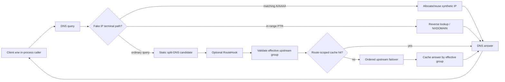

# Архитектура DNS Lattice

Статус: реализована до стадии 1.0 включительно. Код, тесты,
кроссплатформенная feature-матрица, observability boundary, package
validation, release automation и аудит заморозки публичного API завершены.
`dns-lattice`, `dns-lattice-core` и `dns-lattice-model` опубликованы на
crates.io как стабильные релизы `1.x` (текущую версию см. в
[CHANGELOG.md](CHANGELOG.md)); публичный API следует обычной
SemVer-дисциплине внутри линейки `1.x`.

Этот документ описывает архитектуру на границе стабильного релиза `1.x`,
установленной релизом `1.0.0`. Обновляйте его при каждом будущем
минорном/мажорном релизе, меняющем публичный контракт.

## Область ответственности и место в экосистеме Lattice

DNS Lattice — **встраиваемый DNS server/resolver engine**. Это DNS-протокольный
и control-plane компонент семейства Lattice: приложение встраивает его, чтобы
разбирать и обслуживать DNS, маршрутизировать запросы, кэшировать ответы,
использовать шифрованные DNS-транспорты, синтезировать Fake IP и подключать
динамический выбор маршрута без запуска отдельного DNS-демона.

```text
net-lattice      Инспекция/настройка сети ОС (routes, DNS, interfaces)
tunnel-lattice   TUN/TAP-интерфейсы и связанные data-plane примитивы
dns-lattice      Программируемый DNS resolver/server engine      <- этот репозиторий
flow-lattice     Компилятор политик: rules -> platform-neutral network plans
sdk-lattice      Application-facing слой композиции
```

Границы зависимостей и ответственности намеренные:

- `net-lattice` владеет DNS/resolver-настройками ОС. DNS Lattice не изменяет
  системные DNS-настройки.
- `tunnel-lattice` владеет TUN/TAP-устройствами и packet forwarding. У DNS
  Lattice нет прямой зависимости от него.
- `flow-lattice` может реализовывать route-hook контракт DNS Lattice и влиять
  на маршрутизацию запросов, но DNS Lattice не компилирует пользовательский
  язык правил.
- `sdk-lattice` или другое host-приложение компонует DNS Lattice с соседними
  компонентами семейства.

## Цели дизайна

- **Встраиваемое серверное ядро.** Host может создать, bind, запустить и
  остановить входящие DNS listeners без обёртки вокруг отдельного демона.
- **Resolver и server в одном engine.** Один и тот же resolver pipeline можно
  использовать напрямую in-process или за входящими UDP/TCP/DoT/DoH/DoQ
  listeners.
- **Split DNS.** Статическая политика выбирает upstream group через
  детерминированный domain matcher.
- **Программируемая маршрутизация.** Один необязательный caller-owned route
  hook может выбрать другую существующую upstream group для обычного запроса.
- **Fake IP.** Детерминированное обратимое выделение синтетических IPv4/IPv6 с
  TTL, ограниченным per-family LRU-вытеснением, reverse lookup и caller-owned
  process-local snapshots.
- **Транспорт-независимое ядро.** UDP, TCP, DoT, DoH (HTTP/1.1, HTTP/2,
  HTTP/3) и DoQ реализуют явные transport boundaries и не протекают в
  resolver policy.
- **Детерминированная cache identity.** Обычные кэшированные ответы включают
  effective upstream group в область идентичности, поэтому одинаковые DNS
  questions, отправленные разными маршрутами, не могут случайно разделить
  ответ.
- **Неавторитетная наблюдаемость.** Структурированные события показывают
  переходы resolver pipeline, но не дают sink права влиять на routing, cache,
  retries или ответы.
- **Нет скрытого global state.** Resolver, cache, Fake IP state, hooks,
  observability, server listeners и upstream backends принадлежат явно
  созданным вызывающим кодом объектам.
- **Cross-platform first.** Поддерживаемый public surface собирается и
  тестируется на Linux, Windows и macOS с одинаковым поведенческим контрактом.

## Не-цели

DNS Lattice не:

- владеет или изменяет resolver-конфигурацию ОС;
- управляет TUN/TAP-устройствами и не пересылает произвольные пакеты;
- компилирует пользовательский/operator rule language;
- поставляет standalone CLI/config-file/service-supervision продукт;
- выполняет долговременное хранение Fake IP state и не задаёт формат
  сериализации snapshots;
- выполняет скрытые OS/network side effects из route hooks или observability
  callbacks.

Host-приложение может построить такие возможности вокруг DNS Lattice, но они
не входят в authority этого крейта.

## Структура workspace и модулей

Workspace содержит три публикуемых крейта:

```text
dns-lattice-core     Общая граница Error/Result
dns-lattice-model    DNS wire model, matcher и split-DNS policy types
dns-lattice          Public facade + реализация resolver/server
```

`dns-lattice-core` и `dns-lattice-model` намеренно не содержат socket- или
OS-интеграции. `dns-lattice` одновременно является рекомендуемым публичным
facade crate и местом реализации runtime engine modules.

Канонические публичные модули:

```text
dns_lattice::core           общий Error/Result
dns_lattice::model          DNS message/record/name/matcher/policy types
dns_lattice::engine         Resolver и ResolverBuilder
dns_lattice::upstream       outbound backend trait и transports
dns_lattice::server         inbound listeners и server lifecycle
dns_lattice::fakeip         synthetic address pool/policy/snapshots
dns_lattice::hooks          dynamic route-selection hook contract
dns_lattice::observability  structured resolver event sink contract
```

Плоских root aliases для domain types намеренно нет. Приложения должны
импортировать типы из канонического domain module, чтобы API boundary оставался
явным перед freeze стадии 1.0.

## Поток данных resolver


```mermaid
flowchart LR
    Client[Client или in-process caller] --> Query[DNS query]
    Query --> Fake{Fake IP terminal path?}
    Fake -->|matching A/AAAA| FakeAlloc[Allocate/reuse synthetic IP]
    Fake -->|in-range PTR| FakeReverse[Reverse lookup / NXDOMAIN]
    FakeAlloc --> Answer[DNS answer]
    FakeReverse --> Answer
    Fake -->|ordinary query| Static[Static split-DNS candidate]
    Static --> Hook[Optional RouteHook]
    Hook --> Validate[Validate effective upstream group]
    Validate --> Cache{Route-scoped cache hit?}
    Cache -->|yes| Answer
    Cache -->|no| Upstream[Ordered upstream failover]
    Upstream --> CacheStore[Cache answer by effective group]
    CacheStore --> Answer
    Answer --> Client
```

Порядок resolver pipeline является частью контракта:

1. проверить/декодировать DNS query и определить первый question для routing;
2. выполнить terminal Fake IP handling, если его выбирает policy;
3. вычислить статического split-DNS кандидата;
4. вызвать не более одного optional route hook;
5. проверить effective group, выбранную static policy/hook;
6. проверить cache в области этой effective group;
7. попробовать upstream backends в порядке регистрации;
8. закэшировать cacheable answer и вернуть его.

Ошибка hook, неизвестная выбранная group или group без backends — это ошибка.
DNS Lattice не выполняет молчаливый fallback к другой static group после
ошибки hook или некорректного выбора.

## DNS-модель и matching

`dns-lattice-model` владеет protocol/domain типами, используемыми engine:

- DNS `Message`, `Header`, `Question` и `ResourceRecord` wire model;
- record/class/RData types, необходимые реализованному engine;
- DNS `Name` и bounded name decompression/encoding;
- `DomainPattern` и `DomainMatcher<T>` с детерминированным приоритетом
  exact/suffix/wildcard;
- `UpstreamGroupId` и `SplitDnsPolicy`.

Некорректный input должен возвращать typed error, а не panic или бесконечный
цикл. Hardening стадии 0.6 добавил детерминированное property-style покрытие
parsing, compression bounds и matcher precedence.

## Контракт кэша

Resolver владеет in-memory answer cache с учётом positive TTL и RFC 2308-style
negative caching. Cache identity включает effective upstream group вместе с
идентичностью DNS question. Это необходимо для dynamic routing: ответ,
полученный через один маршрут, не должен обслужить запрос, который hook
направил в другую group. Биты RD и EDNS DO (RFC 3225) запроса тоже входят в
identity.

Сохраняются только чистые ответы (opcode QUERY, `TC=0`, корректная запись OPT
с расширенным RCODE EDNS 0, если она есть, и `NOERROR` с записями, `NXDOMAIN`
или `NODATA`) — без записи OPT; TTL записей по умолчанию ограничены сутками
(positive) или часом (negative), а время жизни negative-ответа равно
min(TTL SOA, `MINIMUM` SOA), либо 60 с без SOA. `CacheConfig` меняет границы
TTL и время жизни без SOA. Попадание уменьшает каждый TTL на целые прошедшие
секунды, повторяет id, question и бит RD текущего запроса, сбрасывает AA и
сохраняет порядок записей.

Хранилище приватно для facade-крейта и ограничено по памяти. Оно разделено на
число шардов, равное степени двойки, у каждого своя блокировка, поэтому
параллельные запросы конкурируют только при попадании в один шард. Ключ — одна
каноническая строка байт: индекс effective group, type, class, биты RD и DO и
имя в нижнем регистре в wire-форме; он собирается в буфере на стеке и хешируется
один раз ключевым хешем resolver (устойчивым к hash flooding); старшие биты
хеша выбирают шард, а каждое попадание сравнивает ключ целиком, поэтому
коллизия хеша заменяет более старый ключ и никогда не отдаёт чужой ответ.
Блокировка шарда покрывает только поиск и увеличение счётчика ссылок; ответ
собирается после её освобождения, а callbacks observability под ней не
выполняются.

Каждый шард владеет равной долей `CacheConfig::max_bytes` (по умолчанию
16 MiB). Стоимость записи — детерминированная структурная оценка занятой ею
кучи, считается один раз при вставке. Предел проверяется синхронно при каждой
вставке, которая вытесняет по одной записи, пока шард не уложится в свою долю
(фоновый чистильщик мог бы отстать от атакующего); запись дороже одной восьмой
доли не сохраняется, а кэш никогда не сбрасывается целиком. Вытеснение сначала
берёт истёкшую запись, с самым ранним сроком. Иначе работает S3-FIFO: новые
ключи попадают в малую очередь (10 % доли) и переходят в основную, только если
к ним обращались, поэтому одноразовые имена, например потоки случайных
поддоменов с NXDOMAIN, отбрасываются, а повторно используемые остаются;
ghost-кольцо помнит только хеши отброшенных ключей, чтобы вернувшийся ключ
сразу попадал в основную очередь. Истёкшая запись никогда не повышается.
`CacheConfig::disabled()` вообще не создаёт хранилище.

Запрос использует кэш только при ровно одном question, opcode QUERY и без
опции EDNS Client Subnet и без опций EDNS, кроме NSID, COOKIE, TCP keepalive
и Padding; любой другой запрос идёт мимо кэша и объединения, поэтому ответ,
зависящий от клиента, никогда не разделяется.

Параллельные промахи с одним ключом кэша объединяются
(`CacheConfig::coalesce`, включено по умолчанию). Приватный реестр flight,
разбитый на шарды по тем же каноническим байтам ключа и тому же ключевому
хешу, что и хранилище, держит один watch-канал на ключ. Первый промах
регистрирует flight и становится ведущим: перепроверяет кэш, выполняет
упорядоченный failover-цикл, вставляет кэшируемый ответ в хранилище, затем
снимает flight с регистрации и публикует результат присоединившимся
ведомым, поэтому запрос, пришедший в любой момент, находит либо flight, либо
запись. Ведомый ждёт на канале и отвечает по опубликованному результату
(кэшируемый ответ собирается как при попадании; некэшируемый, например
`SERVFAIL`, — с заменой только транзакционных полей; либо ошибка ведущего);
он выдаёт `CacheMiss`, затем `CacheEvent::Coalesced` через `record_cache`
(метод `ObservabilitySink` с реализацией по умолчанию), затем терминальное
событие и ни одного upstream-события. Ничего не порождается (spawn): отменённый
ведущий публикует состояние «отменён» из drop guard и снимает регистрацию, а
первый ожидающий ведомый, перерегистрировавшись, становится новым ведущим —
схема работает на любом executor. Счётчик эпохи purge проверяется под
блокировкой шарда при вставке ведущего, поэтому ответ, полученный до
инвалидации, возвращается и публикуется, но не сохраняется. Блокировка шарда
flight охватывает одну операцию с картой.

`Resolver::clear_cache`, `purge` и `purge_subtree` сначала увеличивают
счётчик эпохи purge, а затем по одному блокируют шарды: вставка, уже
прошедшая проверку эпохи, держит блокировку шарда и удаляется обходом, а
любая более поздняя вставка отклоняется. `purge` и `purge_subtree` просматривают
слоты каждого шарда и сравнивают часть ключа с именем (в ключе сначала идут
группа, тип, класс и форма запроса, поэтому один purge охватывает их все);
поиск по поддереву проверяет только суффиксы, начинающиеся на границе метки.
Сброс обнуляет шард, но сохраняет его счётчики. `Resolver::cache_stats`
суммирует счётчики шардов, ведущиеся под их блокировками (вставки,
вытеснения, истечения, отклонения по размеру, записи, байты), и три relaxed
атомика исходов поиска (hits, misses, coalesced) и счётчик обновлений;
блокировка не держится дольше одного шарда, и запросы не останавливаются.
Запрос, который промахнулся, повёл вызов и нашёл ответ, сохранённый за это
время, выдаёт `CacheMiss` и считается промахом, поэтому `hits` может слегка
занижать число ответов, обслуженных хранилищем.

Prefetch (`CacheConfig::prefetch`, по умолчанию выключен) — единственная
возможность, которая порождает задачи. Резолвер — тонкий дескриптор над
общим внутренним состоянием (`Arc`) и `JoinSet` задач обновления; задачи
держат внутреннее состояние, но не дескриптор, поэтому удаление `Resolver`
удаляет набор и прерывает все обновления. Каждая запись считает свои
свежие попадания и несёт одноразовый флаг `refreshing`. Свежее попадание,
которое достигло порога по числу попаданий, находится в заданной доле срока
жизни записи до её истечения, застаёт менее 256 идущих обновлений и handle
среды Tokio и выигрывает флаг, регистрирует flight для ключа как ведущий
(отступая, если ведущий уже есть) и порождает задачу, которая выполняет тот
же failover-цикл и вставку, что и промах, для группы этого попадания без
повторного вызова hook, и публикует результат присоединившимся ведомым. Она
выдаёт только `CacheEvent::RefreshStarted` и `CacheEvent::RefreshCompleted`
с новым correlation id и никогда `ObserveEvent`, а эпоху purge учитывает как
любой ведущий. Без среды Tokio ничего не происходит и паники нет.
Блокировка набора задач держится только на время очистки завершённых задач
и порождения; callback sink под ней не выполняется.

Каждый ответ resolver — попадание в кэш, Fake IP или свежий ответ upstream —
согласуется с состоянием EDNS(0) запроса: без записи OPT в запросе в ответе
её нет; с ней ответ без корректной записи OPT получает новую (1232 байта,
версия 0, бит DO запроса, без опций), а запись OPT свежего ответа upstream
сохраняется как получена.

Terminal Fake IP ответы обходят обычный answer cache, поскольку их lifetime
определяется самим Fake IP mapping.

## Контракт Fake IP

`fakeip::FakeIpPool` синхронный и внутренне синхронизированный, поэтому им
можно делиться между конкурентными resolver calls. Pool может включать IPv4,
IPv6 или оба семейства. Для каждого семейства он предоставляет:

- детерминированное domain -> synthetic-address allocation/reuse;
- address -> active-domain reverse lookup;
- bounded inclusive address ranges;
- per-family LRU eviction при заполнении диапазона;
- обязательный whole-second TTL и expiry;
- caller-owned in-memory snapshot/restore живых mappings и LRU state.

`FakeIpPolicy` явно включает resolver synthesis. Совпавшие IN A/AAAA queries
возвращают локальный synthetic answer; канонические PTR queries по
сконфигурированным диапазонам возвращают active mapping либо NXDOMAIN.
Выбранное, но отключённое address family возвращает local NODATA. DNS TTL
никогда не превышает remaining lifetime mapping.

Крейт не предоставляет durable persistence или serialization format для
snapshots.

## Контракт route hook

`hooks::RouteHook` — optional one-at-a-time selection boundary. Hook получает
первый DNS question и tentative static upstream group и возвращает одно из
двух решений:

- `Use(group)` — использовать выбранную caller существующую upstream group;
- `Abstain` — оставить static candidate.

Hook не получает resolver/backend handles, не переписывает DNS answers, не
меняет cache policy, не выполняет resolver re-entry и не получает OS/network
side-effect authority через DNS Lattice. Реализация hook сама владеет timeout,
retry, cancellation cleanup и внешними интеграциями, которые она вызывает.

Drop resolver future приводит к drop in-flight hook future. Re-entry в тот же
resolver запрещён, поскольку создаёт recursion/deadlock semantics, которым не
место в routing boundary.

## Контракт observability

`observability::ObservabilitySink` — opt-in, synchronous и
non-authoritative. Resolver отправляет immutable bounded events о query
receipt, terminal Fake IP behavior, route selection/hook outcomes, cache
hit/miss, upstream attempts/outcomes, timeouts и terminal failures.

Контракт sink имеет строгие свойства изоляции:

- сигналы кэша вне упорядоченного потока (сейчас — запрос, присоединившийся
  к чужому in-flight upstream-вызову) приходят как
  `observability::CacheEvent` через `ObservabilitySink::record_cache` — метод
  с реализацией по умолчанию, который существующим sink не нужно
  реализовывать;
- callback не может изменить resolver decision или answer;
- callback не получает resolver/backend handles или privileged OS authority;
- resolver locks освобождаются до вызова callback;
- panic callback изолирован от корректности resolver;
- DNS Lattice не создаёт background logging queue и не требует конкретного
  logging framework.

Приложение может адаптировать эти events к tracing, metrics, logs или telemetry
за пределами крейта.

## Контракт upstream transports

`upstream::UpstreamBackend` асинхронный. Matched upstream group владеет
упорядоченным списком backends. Resolver пробует их в порядке регистрации;
timeout/transport/TLS failures могут переключить выполнение на следующий
backend. Если все backends завершились ошибкой, возвращается последняя ошибка,
а успешный answer в cache не вставляется.

Каждый встроенный backend перед возвратом проверяет, что декодированный
response отвечает на его query: бит `QR` должен быть установлен, а question
section должна совпадать с query (имя сравнивается без учёта регистра, плюс
type и class). UDP, TCP и DoT дополнительно требуют, чтобы message id ответа
совпадал с id запроса; DoH и DoQ его не сравнивают, потому что RFC 8484 и
RFC 9250 передают по сети id 0 (DoQ backend сам отправляет query с id 0).
DoH и DoQ возвращают response с id исходного query. UDP backend отбрасывает
датаграмму, которая не декодируется или не совпадает, и продолжает ждать до
своего timeout; stream transports сообщают о
несовпадении как о transport error, и resolver переключается на следующий
backend.

Реализованные transports:

| Transport | Cargo feature | Примечание |
|---|---|---|
| UDP | default | Переходит на TCP при truncated response (`TC=1`). |
| TCP | default | RFC 1035 length-prefixed framing. |
| DoT | `dot` | TLS через `rustls`/`tokio-rustls`. |
| DoH HTTP/1.1 + HTTP/2 | `doh` | TLS/HTTP через `hyper`/`hyper-rustls`. |
| DoH HTTP/3 | `doh` | QUIC/HTTP3, ALPN `h3`, TLS 1.3. |
| DoQ | `doq` | QUIC, ALPN `doq`, TLS 1.3. |

Encrypted features по умолчанию выключены, поэтому baseline UDP/TCP build не
получает TLS/HTTP/QUIC dependency weight.

## Контракт inbound server

`server::ServerBuilder` встраивает `Arc<Resolver>` и может bind несколько
типов listeners:

- UDP и TCP в baseline build;
- DoT с `dot`;
- DoH поверх HTTP/1.1/HTTP/2 и DoH3 поверх HTTP/3 с `doh`;
- DoQ с `doq`.

Host передаёт TLS/QUIC server configuration и certificate material. DNS Lattice
не генерирует сертификаты и не запрашивает privileged ports. Resolver errors
представляются DNS `SERVFAIL` answers там, где inbound protocol содержит
валидный DNS request, на который можно ответить; malformed requests без
надёжной DNS transaction identity обрабатываются согласно documented protocol
validation конкретного listener.

Все listeners отвечают через один общий путь EDNS(0) (RFC 6891):

- запрос с более чем одной записью OPT или с записью OPT, которая не
  разбирается (имя владельца не корень или опция выходит за пределы данных
  записи), получает локальный `FORMERR` с одной голой записью OPT сервера
  (размер payload сервера, версия 0, бит DO сброшен, без опций), как того
  требует RFC 6891 §7, чтобы клиент мог отличить ошибку формата внутри EDNS
  от сервера без EDNS;
- запрос с версией EDNS выше 0 получает локальный `BADVERS` (расширенный
  RCODE 1) с записью OPT сервера;
- ни тот, ни другой не доходят до resolver; любой другой запрос
  разрешается, и его ответ несёт ровно одну запись OPT — с размером payload
  сервера, версией 0 и сохранёнными битом DO и опциями записи OPT upstream
  либо битом DO запроса для новой записи — тогда и только тогда, когда она
  была в запросе.

`ServerBuilder::edns_udp_payload_size` задаёт максимум сервера (по умолчанию
1232 байта, не меньше 512). UDP-ответ ограничен 512 байтами для клиента без
EDNS и min(размер payload клиента, поднятый до 512, максимум сервера) для
EDNS-клиента; более крупный ответ отправляется с пустыми секциями и `TC=1`,
сохраняя запись OPT. Stream transports никогда не усекаются.

Со стороны upstream `UdpBackend` по умолчанию не добавляет запись OPT.
`UdpBackend::with_edns_udp_payload_size` включает это: запрос без записи
OPT отправляется с записью, объявляющей заданный размер payload (не менее
512, DO сброшен, без опций), а запрос с записью OPT, корректной или нет,
пересылается без изменений. Если upstream отвечает `FORMERR` или `NOTIMP`
без записи OPT (RFC 6891 §7), исходный запрос отправляется ещё раз в рамках
того же дедлайна. Запись OPT удаляется из возвращаемого ответа, поэтому кэш
и клиент видят то же сообщение, что и без включения; ответ, чья запись OPT
несёт ненулевой расширенный RCODE, становится `Error::Transport`
(повторяемая ошибка, resolver переключается на другой upstream), потому что
клиенту без EDNS такой код показать нельзя. Усечённый ответ по-прежнему
ведёт к TCP с исходным запросом. Backends TCP, DoT, DoH и DoQ запись OPT не
добавляют.

## Конкурентность и ownership

- Resolver operations асинхронны и могут выполняться конкурентно.
- Shared mutable state синхронизирован внутри и не выставляется как
  unsynchronized public interior mutability.
- Server lifecycle явный: configure, bind, serve, shutdown.
- Нет process-wide resolver/cache/hook/sink/Fake IP singleton.
- Cancellation выражается drop futures, а не скрытым worker ownership в core
  resolver path.

## Контракт платформ и валидации

Cross-platform обещание исполняемо в CI. Linux, Windows и macOS запускают
workspace format/lint/check/test/doc validation. Facade также проходит
strict per-feature check/test/rustdoc для:

- `--no-default-features`;
- `dot`;
- `doh`;
- `doq`;
- `--all-features`.

CI дополнительно перечисляет package contents workspace и запускает hermetic
release-automation regression. Эти validation paths не публикуют crates и не
требуют privileged OS networking.

## Граница стабилизации стадии 1.0

Стадия 1.0 была намеренно посвящена обязательству по контракту, а не новой
feature family, и теперь завершена:

- проведён аудит каждого public module/type/trait/method на случайно
  выставленный surface и полноту rustdoc (`#![warn(missing_docs)]` во всех
  публикуемых крейтах; 0 предупреждений под strict rustdoc);
- определён и задокументирован compatibility surface, защищаемый SemVer;
- проверены package contents и docs.rs behavior для финального public
  surface;
- синхронизированы README, architecture, roadmap, changelog, security/support
  и crate documentation с замороженным API;
- `dns-lattice`, `dns-lattice-core` и `dns-lattice-model` опубликованы как
  `1.0.0` на crates.io.

Внутри линейки `1.x` теперь применяются обычные требования SemVer:
аддитивный public API — минорный релиз, совместимые фиксы — патч-релизы,
breaking change к чему-либо из перечисленного выше требует явного,
санкционированного пользователем мажорного бампа.
